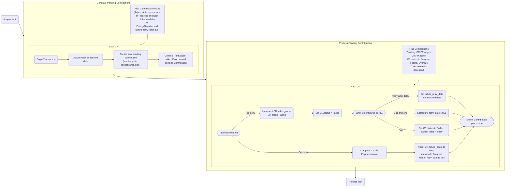

# Reference

## Hook (Symfony event) `civi.recur.nextschedcontributiondatealter`

Other extensions (more likely, *one* other extension) can listen for this event to take control over setting the `next_sched_contribution_date` for a recurring contribution.

Your listener should look like this:

```php
<?php

function mylistener(\Civi\Core\Event\GenericHookEvent $event) {
  // Some process here decides what the new date should be.
  // $event comes with:
  // $event->originalDate          The current date that we will be updating.
  // $event->newDate               The date that we will update it to.
  // $event->frequency_interval    e.g. 1
  // $event->frequency_unit        e.g. "month"
  // $event->cycle_day             e.g. 1 or could be something awkward like 31
  // $event->contribution_recur_id

  // Example: jump over weekends, avoiding gotchas with daylight saving.
  while (date('N', strtotime("$event->newDate 09:00:00")) > 5) {
    $event->newDate = date('Y-m-d', strtotime("$event->newDate 09:00:00 + 1 day"));
  }
}

```

## How varioud IDs align between Adyen and CiviCRM entities

A PSP reference is Adyen's unique 16-character reference for this payment, or more specifically, anything that happens to a payment.

- PaymentProcessor
   * `payment_processor_type.name` ← literal string `'adyen'`
   * `name` ← Adyen’s `merchantAccount`
- PaymentToken
   * `token` ← Adyen’s `recurringDetailReference`
   * `expiry_date`
   * `masked_account_number` ← `{cardtype} … {last 4 card digits}`
- ContributionRecur
   * `payment_token_id`
   * `payment_processor_id`
   * `processor_id` ← Adyen’s `shopperReference` (set by the external OSF)
- Contribution: *initial instance created by OSF*
   * `contribution_recur_id`
   * `invoice_id` ← Adyen’s `merchantReference` (set by the external OSF)
   * `trxn_id` ← set from the payment ↰
- Payment: *for initial Contribution*
   * `trxn_id` ← Adyen’s `PspReference`
   * `payment_processor_id`
- Contribution: *subsequent instances*
   * `contribution_recur_id`
   * `invoice_id` ← generated by Adyen extension, from Civi’s Contribution and ContributionRecur IDs, like: `'CiviCRM-cn123-cr456'`
   * `trxn_id` ← set from the payment ↰
- Payment: *for subsequent Contributions*
   * `trxn_id` ← Adyen’s `PspReference`
   * `payment_processor_id`


## How taking new recurring payments happens API4 `ContributionRecur.ProcessAdyen` calls



