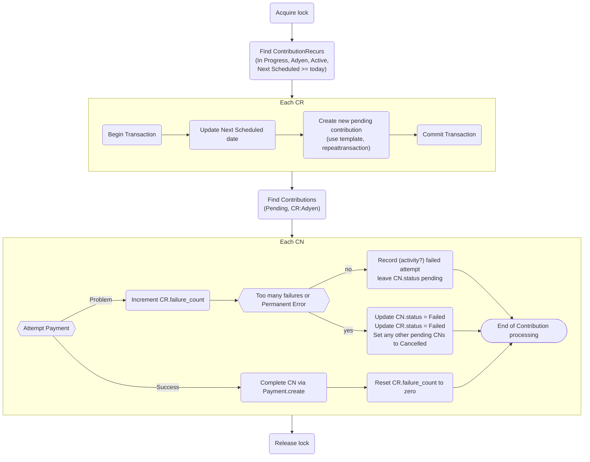

# Reference

## Hook (Symfony event) `civi.recur.nextschedcontributiondatealter`

Other extensions (more likely, *one* other extension) can listen for this event to take control over setting the `next_sched_contribution_date` for a recurring contribution.

Your listener should look like this:

```php
<?php

function mylistener(\Civi\Core\Event\GenericHookEvent $event) {
  // Some process here decides what the new date should be.
  // $event comes with:
  // $event->originalDate          The current date that we will be updating.
  // $event->newDate               The date that we will update it to.
  // $event->frequency_interval    e.g. 1
  // $event->frequency_unit        e.g. "month"
  // $event->contribution_recur_id

  // Example: jump over weekends, avoiding gotchas with daylight saving.
  while (date('N', strtotime("$event->newDate 09:00:00")) > 5) {
    $event->newDate = date('Y-m-d', strtotime("$event->newDate 09:00:00 + 1 day"));
  }
}

```

## How taking payments happens (plan) @todo update



- The process is split into two loops. It would make sense for it to run daily.
- The first loop creates Pending Contributions for each due ContributionRecur tracked by the CR's next scheduled date field.
   - A transaction is used so that the next scheduled date only advances after a successful CN creation.
- The second loop attempts to process all the pending contributions one by one.
   - Successful contributions are recorded
   - Soft failures leave the pending CN as was, so it will be retried next run.
   - An improvement in this loop might be to collect failed CR IDs, and skip processing CNs that belong to CRs that have failed today (e.g. lack of funds).
   - If a CR fails too much, the contribution is marked Failed as is the CR (preventing any new contributions being created from it), and any CNs are also failed.

@todo: How to record failed attempts?
<https://chat.civicrm.org/civicrm/pl/di9o7b8sifypu8iw3xmxxskzqr>
